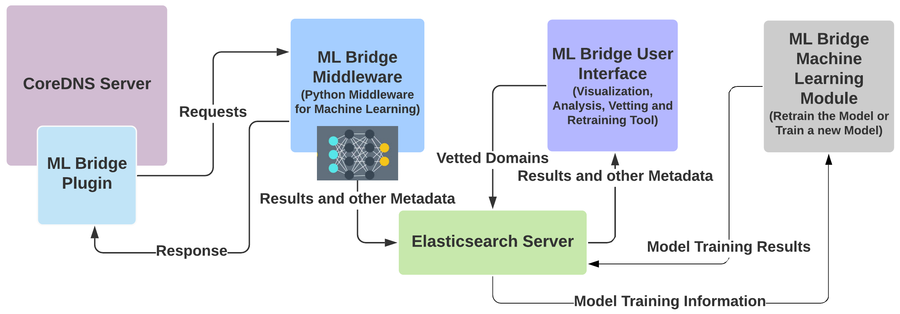
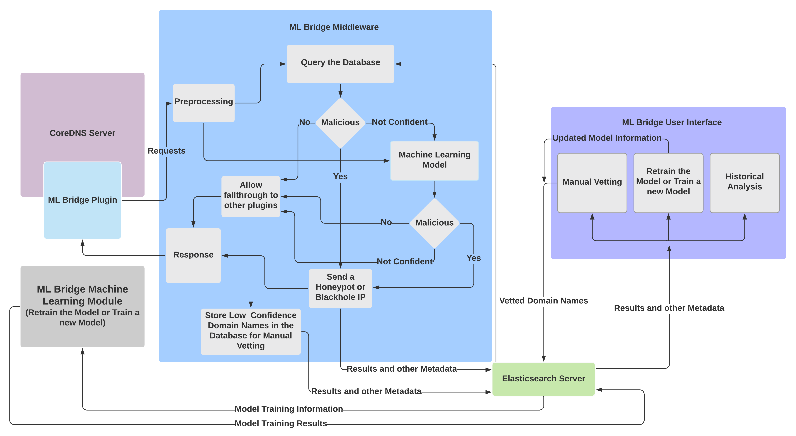

<p float="left" align = "center">
  
</p>

# Overview

This organisation is the result of my work on a project during Google Summer of 
Code 2020, as a part of the Cloud Native Computing Foundation.

The ML Bridge organisation provides machine learning capabilities to languages 
and platforms that generally have a dearth of such capabilities. 

Currently, it is being used to integrate machine learning capabilities with 
CoreDNS, to protect people against malicious websites and applications. It helps
in identifying websites that could be potentially used by malicious hackers and 
cybercriminals and prevents the user from accessing such websites.

# Table of Contents

- [Getting Started](#getting-started)
- [Approach](#approach)
    - [General Overview](#general-overview)
    - [Machine Learning](#machine-learning)
- [The Inner working of ML Bridge](#the-inner-working-of-ml-bridge)
    - [The ML Bridge Plugin](#ml-bridge-plugin) 
    - [The ML Bridge Middleware](#ml-bridge-middleware)
    - [The ML Bridge User Interface](#ml-bridge-user-interface)
    - [The ML Bridge Machine Learning Module](#ml-bridge-machine-learning-module)
- [Code Documentation](#code-documentation)

# Getting Started

The repositories in the ML Bridge organisation require the Elasticsearch Server.
To install the Elasticsearch Server please follow the instructions that can be 
found in this [link](https://phoenixnap.com/kb/install-elasticsearch-ubuntu).

For installing each component in the ML Bridge organisation please find the 
individual installation instructions in each individual repository. The links 
to the individual repositories can be found below:

- [The ML Bridge Plugin (A CoreDNS Plugin)](https://github.com/mlbridge/coredns-mlbridge)
- [The ML Bridge Middleware](https://github.com/mlbridge/mlbridge-middleware)
- [The ML Bridge User Interface](https://github.com/mlbridge/mlbridge-ui)
- [The ML Bridge Machine Learning Module](https://github.com/mlbridge/mlbridge-machine-learning)

To install and start CoreDNS please take a look at the CoreDNS 
[repository](https://github.com/coredns/coredns). Add the `mlbridge` plugin to
CoreDNS. To add external plugins, please take a look at the 
[example plugin](https://github.com/coredns/example).

Create a new directory `mlbridge` by using the following the command:

```
mkdir mlbridge
```

The recommended file structure while cloning the repositories can be found 
below:

```
mlbridge
   |__ mlbridge-machine-learning 
   |__ mlbridge-middleware
   |__ mlbridge-ui
```

To start the ML Bridge software suite, first start the Elasticsearch Server. The
instructions to start the same can be found in this
[link](https://phoenixnap.com/kb/install-elasticsearch-ubuntu).

Next, start the CoreDNS Server. The CoreDNS can be started by following the 
instructions found in this [link](https://github.com/coredns/coredns).

Then, go to the `mlbridge` directory by using the following command:

```
cd mlbridge
``` 

Finally, execute the following script to start the ML Bridge software suite:

```
python mlbridge-ui/mlbridge_ui/src/ui.py &
python mlbridge-middleware/mlbridge_middleware/src/middleware.py &
python mlbridge-machine-learning/python-code/training/py 
```

# Approach

## General Overview

CoreDNS is a DNS Server written in Go. However, Go currently does not have 
native libraries for the interaction with the CUDA platform, which is essential 
for machine learning applications. At the same time, the Python ecosystem has 
tools like TensorFlow, PyTorch, MXNet and various others that not only interact 
with the CUDA platform but also allows for the easy prototyping and evaluation 
of deep learning models.

<p float="left" align = "center">
  
</p> 

This project combines the deep learning capabilities that the Python ecosystem 
provides, with CoreDNS, by creating:

- **An ML Bridge Plugin (a CoreDNS Plugin):** The plugin intercepts requests and 
forwards them to the Application Middleware for further processing. The 
repository for the ML Bridge Plugin can be found 
[here](https://github.com/mlbridge/coredns-mlbridge). 

- **An ML Bridge Middleware:** The middleware receives the request from the ML 
Bridge Plugin along with other metadata. The middleware infers whether the 
request is from a malicious or a benign website, from a vetted list. However, if 
the domain is not in the vetted list, a machine learning model infers whether 
the request is malicious or benign, and then sends back a response to the plugin
whether to allow the request or block it. It stores the result as well as other 
metadata to a database. The repository for the ML Bridge Middleware can be 
found [here](https://github.com/mlbridge/mlbridge-middleware).

- **An ML Bridge User Interface:** The user interface is used to analyse 
historical trends as to how many people are accessing malicious websites and at 
what frequency. It is also used to manually vet websites and classify them as 
malicious or benign. The user interface is also used to train new machine 
learning models or retrain existing models by communicating with the ML Bridge 
Machine Learning module. The repository for the ML Bridge User Interface can be 
found [here](https://github.com/mlbridge/mlbridge-ui).

- **An ML Bridge Machine Learning Module:** The machine learning module is used 
to train new models or retrain existing ones. The module receives model 
training information from the details entered by the user in the Training section 
of the ML Bridge User Interface. The model is then trained according to the 
information entered, and then the results of the training are communicated back 
to the ML Bridge User Interface. The ML Bridge User Interface then displays the 
result in the form of accuracy and loss graphs as well as confusion matrices and 
metrics. The repository got the ML Bridge Machine Learning Module can be found
[here](https://github.com/mlbridge/mlbridge-machine-learning). 

## Machine Learning

### Learning Dataset

The deep-learning model is trained on a COVID-19 Cyber Threat Coalition 
Blacklist for malicious domains that can be found 
[here](https://blacklist.cyberthreatcoalition.org/vetted/domain.txt) and on a 
list of benign domains from DomCop that can be found 
[here](https://www.domcop.com/top-10-million-domains).

Currently, the pre-trained model has been trained on the top 500 domain names 
from both these datasets.

### Learning Process

**Data Preprocessing:** Each domain name is converted into a unicode code point 
representation and then extended to a numpy array of a length 256. The dataset 
was created by combining the malicious domains as well as the non-malicious. 
The dataset was split as follows:
- Train Set: 80% of the dataset.
- Validation Set: 10 % of the dataset
- Test Set: 10% of the dataset

**Training:** The deep-learning model is a Convolutional Neural Net that is 
trained using batch gradient descent with the Adam optimizer.

# The Inner Working of ML Bridge

<p float="left" align = "center">
  
</p> 

## The ML Bridge Plugin

The ML Bridge Plugin is a CoreDNS plugin that forwards requests to the 
ML Bridge Middleware via HTTP POST requests. Once the Middleware processes the 
request, it sends back the prediction, whether the domain name is malicious or 
benign, to the plugin. Depending on the nature of the domain name, the plugin 
can be configured to allow the request to fall through to the other plugins or 
send the request to Honeypot or a Blackhole IP.

## The ML Bridge Middleware

The middleware is a Python Flask Server that contains the pre-trained 
Convolutional Neural Network.The Middleware receives the domain name queried as 
well as the IP address of the machine used to query that particular domain name, 
as a JSON message, via HTTP POST requests from the ML Bridge Plugin.

The Middleware first preprocessess the request forwarded from the 
Machine Learning Plugin. The preprocessed request is then cross checked against 
manually vetted lists. If the request is of a benign domain, a response is 
sent back to the ML Bridge Plugin that allows the fallthrough to other plugins. 
If the request is of a malicious domain, a response is sent back to the ML 
Bridge Plugin that prevents the fallthrough to other plugins. Moreover, the ML 
Bridge Plugin sends back a Honeypot or a Blackhole IP to the user querying the 
malicious domain. If the domain does not exist in the manually vetted list, the 
preprocesssed request is then sent to the machine learning model where it infers 
whether it is benign or malicious.

If the machine learning model is highly confident that the request is of a
benign domain, then a response is sent back to the ML Bridge Plugin that allows 
the fallthrough to other plugins. If the model is highly confident that the 
domain name is malicious, a response is sent back to the ML Bridge Plugin that 
prevents the fallthrough to other plugins. Moreover, the ML Bridge Plugin sends 
back a Honeypot or a Blackhole IP to the user querying the malicious domain. If 
the model is not confident about its prediction, then a response is sent back 
to the ML Bridge Plugin that allows the fallthrough to other plugins. However,
the domain name is stored in the database for manual vetting. 

The classification result as well as other metadata such as the IP address, the 
date and time of the request are stored in a NoSQL database, namely 
Elasticsearch, due to which storing and querying the classification result and 
the metadata is a fast process.

## The ML Bridge User Interface

The ML Bridge User Interface has three main use cases:

- Historical Analysis
- Manual Vetting
- Training or Retraining Models

### Historical Analysis

The application allows the user to historically analyse the frequency at which 
domains have been queried and the IP addresses of the users querying those 
domains. 

The demo of the Historical Analysis can be found below:

<p float="left" align = "center">
  
</p>

The features of Historical Analysis are as follows:

- **Domain Name Analysis:** The user interface enables the user to search for a 
particular domain name along with a time range. The user interface then searches 
for that particular domain name in the Elasticsearch database. Once the domain 
name is found, the user interface will display the number of requests to that 
particular domain name in that time range, the nature of the domain name (benign 
or malicious) and also the IP addresses that have queried that particular domain 
name. This allows for a domain specific analysis.

<p float="left" align = "center">
  
  
</p>

- **Analysis of Malicious Domain Names:** The user interface enables the user to
visualize the top 20 malicious domains queried, as a bar graph. It also displays 
a list of all the malicious domains queried which can be seen via a toggle
switch in the same window. This allows the user to gain a general picture of all
the malicious domain names queried and also helps in identifying model 
misclassification. Moreover, the domain names that the model is not confident 
about, are highlighted in red.

<p float="left" align = "center">
  
  
</p>

- **Analysis of Benign Domain Names:** The user interface enables the user to
visualize the top 20 benign domains queried, as a bar graph. It also displays 
a list of all the benign domains queried which can be seen via a toggle
switch in the same window. This allows the user to gain a general picture of all
the benign domain names queried and also helps in identifying model 
misclassification. Moreover, the domain names that the model is not confident 
about, are highlighted in red.

<p float="left" align = "center">
  
  
</p>

- **WhoIS Information:** The user interface enables the user to access the the
WhoIS records of the domain name. This allows the user to understand more 
information regarding the request queried, thereby enabling the user to make a 
well informed decision while vetting domain names. 

<p float="left" align = "center">
  
</p>

### Manual Vetting

Manual Vetting allows the user to manually vet domain names that the model has a 
low confidence on, thereby creating a new dataset of malicious or benign 
domains. This dataset can be used for blocking or allowing domains and also for 
updating the dataset for retraining the model.

The demo of Manual Vetting can be seen below:

<p float="left" align = "center">
  
</p>

The user can decide whether to classify a non - vetted domain as a benign 
domain, or can be classified as a domain that is malicious or can be selected to
send back Honeypot IP addresses to the malicious domain. 

### Training a new Model or Retraining older Models

The ML Bridge User Interface can be used to train new machine learning models
or retrain older machine learning models. Such a capability is extremely useful
when the current model underperforms or there is new data to train the model on.

A demo of the Training can be seen below:

<p float="left" align = "center">
  
</p>

The user has the ability to enter the number of epochs, the batch size as well
as the sample size for the model training. The loss as well as accuracy graphs 
of the training are updated in real time. Once the training is completed, the 
confusion matrices as well as confusion metrics can be observed to understand 
the efficacy of the model. 

The efficacy of older pre - trained models can also be observed by selecting the
load model option and entering the name of a pre - trained model. 

## The ML Bridge Machine Learning Module

The ML Bridge Machine Learning Module is a module that uses the information 
as provided by the user regarding training, in the User Interface, namely the 
number of epochs, the batch size as well as the sample size to train a new model
or retrain the existing model. The module then communicates back to the User 
Interface the accuracy graph, the loss graph, the confusion matrices as well as 
confusion metrics. A separate module such as the ML Bridge Machine Learning 
Module is used so that the training can happening parallelly while the user can
use the User Interface for other purposes without having to wait for the 
training to complete. 

# Code Documentation

Please click on the individual links to obtain the documentation regarding the 
code for each repository:

- <a href="training.html">ML Bridge Machine Learning Module</a>
- <a href="middleware.html">ML Bridge Middleware</a>
- <a href="ui.html">ML Bridge User Interface</a>


